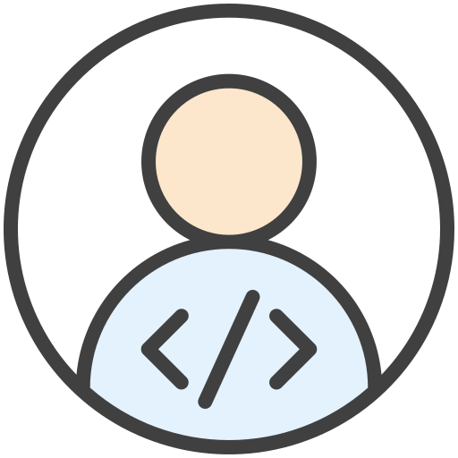
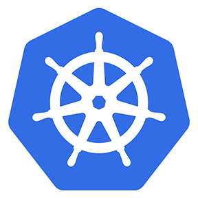

### Hey there 
<a href="https://www.linkedin.com/in/sunandan-bose/">
  
</a>
<a href="https://www.instagram.com/sunandanbose/">
  
</a>
<a href="https://www.facebook.com/sunandan.bose.3/">
  
</a>
<a href="https://leetcode.com/sunandanbose17/">
  
</a>


<br />

Hi, I'm [Sunandan Bose](https://sunandan.vercel.app/), a Backend Developer 🚀 from India, currently, I'm working in  🙍🏽‍♂️ [Adobe](https://www.adobe.com/), Senior Application Engineer. Beside's programming, I am a storyteller, listener, traveler, a cricket enthusiast, and whatnot. I like to have fun, and love to cheer the people with whom I work with.
<br />
Message me if you are looking for a great opportunity at Adobe, India. 
  
  
**Talking about Personal Stuffs:**

- 👨🏽‍💻 I’m currently working on something cool :wink:;
- 🌱 I’m currently learning Javascript and deploying applications using Kubernetes; 
- 💬 Ask me about anything, I am happy to help;
- 📫 How to reach me: [@Sunandan Bose](https://www.linkedin.com/in/sunandan-bose/);
- 📝[Resume](https://drive.google.com/file/d/1nARwPhVoYJ6-csHWOlnYEcAPbxksd1OK/view?usp=sharing)

**Languages and Tools:**  

<code></code>
<code></code>
<code></code>
<code></code>
<code></code>
<code></code>
<code></code>
<code></code>


📊 **This Week I Spent My Time On:**
<!--START_SECTION:waka-->
```text
Java   120 mins         █████████████████████████   100.00 % 
```
<!--END_SECTION:waka-->

🚧 **My Todoist Stats:**
<!-- TODO-IST:START -->
🏆  6,192 Karma Points           
🌸  Completed 0 tasks today           
✅  Completed 459 tasks so far           
⏳  Longest streak is 10 days
<!-- TODO-IST:END -->


📈 My GitHub Stats

<p align="center"> </p>
  


